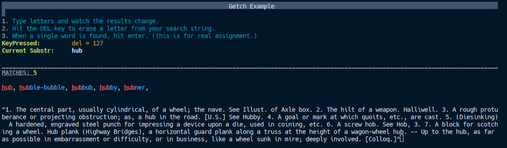
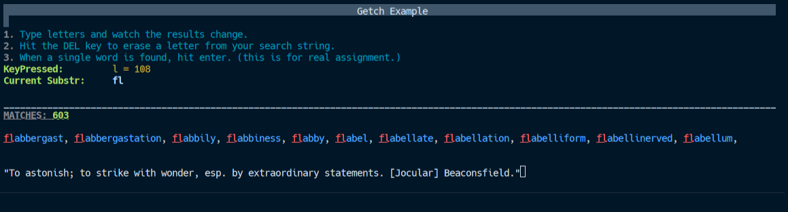
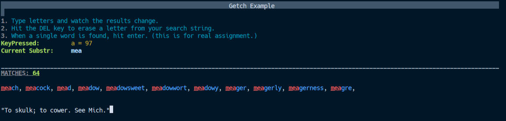
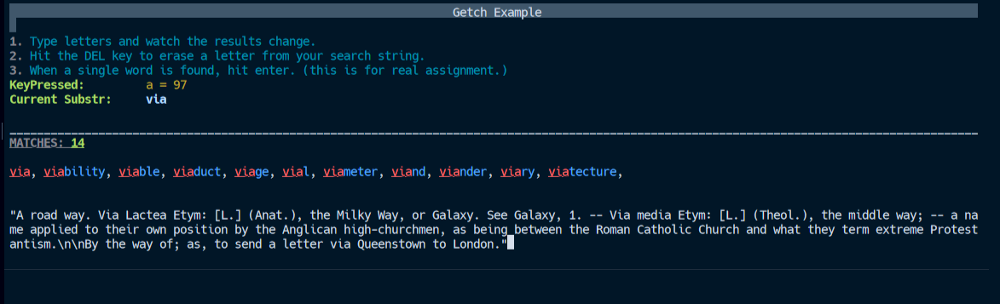

## P02
### Jaxon King
### Description:

A program that uses a getch function to search through a dictionary.json

### Files

|   #   | File             | Description                                        |
| :---: | ---------------- | -------------------------------------------------- |
|   1   | Main.cpp         | Main file with getch, search, and print functions  |
|   2   | loadJsonEx.hpp   | File with function to load a json                  |
|   3   | dictionary.json  | Json file with loads of dictionary words and definitions |
|   4   | json.hpp         | nlohmann's json for cpp library                    |

### Instructions

- Doesn't really work on windows
- https://replit.com/@kingjaxon03/3013-P02-Final run on replit :)
- Will change if it gets fixed

-Here's it running in replit

